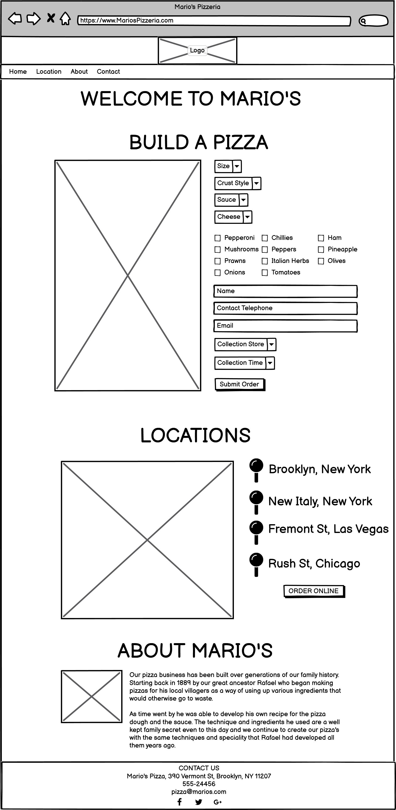
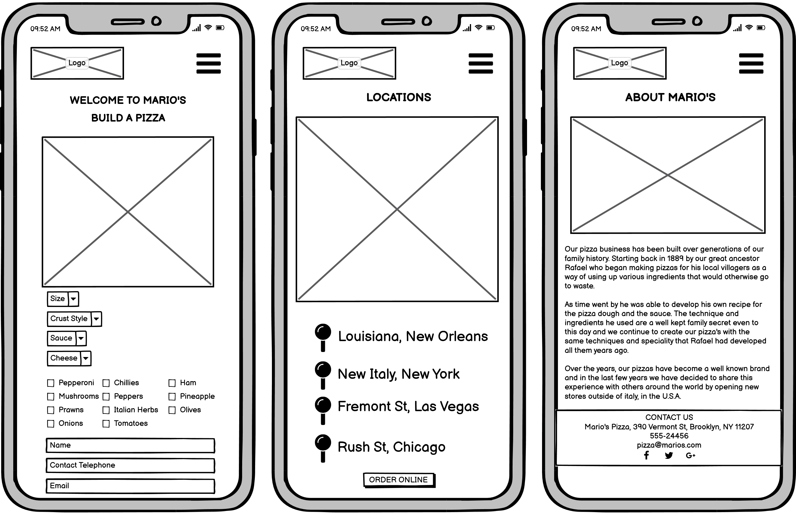
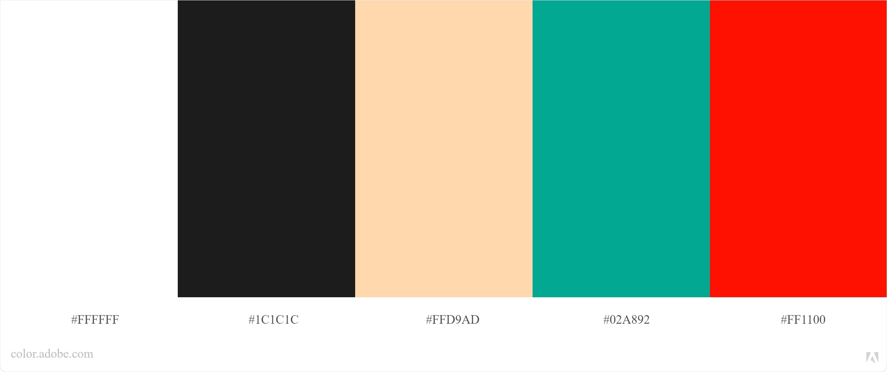

----

This is the README file for my Code Institute MS2 project site, Mario's Pizza

[View the live site here](https://tomossmith.github.io/mariospizza/index.html)
----

A site designed to provide customers an interactive way to pre-order their pizza from their favourite Mario's Store

----
# User Experience (UX)

* ### First Time Visitor Goals
    
     * First Time Visitors, should be able to understand the purpose and reason for the site.
     * First Time Visitors, should be able to easily find the navigation links.       
     * First Time Visitors, should be able to interact with the site upon landing on the site.
        

* ### Returning Visitor Goals

     * Returning Visitors, should be able to quickly access the 'build a pizza' element to pre order their pizza.
     * Returning Visitors, should be able to find where all the stores are located.
     * Returning Visitors, should have an easy way to contact the stores and in some cases, a specific store.
     * Returning Visitors, should be able to find the opening hours and contact information of any store.
     * Returning Visitors, should be able to find social links to be able to engage within the online community.
     * Returning Visitors, should be able to find out more information about the history of the store/brand.

----

* ## Design

* ### Structure & Mockup Designs

     I started my designs by looking at other similar sites for some inspiration.
     I felt that a key element of each site offering a similar service was that most of the sites were one page designs. Also, the key information that the customers needed were presented to them upon landing at the site. So when I designed the site, I wanted to make sure that the custom pizza order was a main feature of the first image of the site.

     As I wasn't sure how well the pizza images and list would fit on a mobile design, I chose to design the site at full size to begin with. This meant I was able to try a number of different styles of laying out the form without having to worry about space.
     Once I had established the key information I was going to use, I was then able to use the main design and simply drag and drop the form elements into a design I felt worked well on mobile.

     Once I had designed my main feature, I went about seeing what type of navigation would best suit the site. I decided to include a brand navigation bar where the business logo could be placed on the left top corner and as I had very little navigation links, it was easy to style the navigation bar without worrying about content being missed.
     All the links on the navigation bar take the customer to a section within the site and doesn't have the need to include any dropdowns, I think this was important so that the main content of the site was not hidden at any point.

     Following on down the one page design, I felt it was important for the next section to include any additional key information that the customers need to know about the business. I chose to include a section for the customers to find out where all of the business's are located and any specific information for each store e.g. Opening Hours etc.
     I chose to integrate a custom Google Map with markers to point out where each of the stores are located. The initial view of the map is in a zoomed out state so that all markers are visible to the customer, from there on they are able to click which store they would like to know more about, which opens an information box with the store address, opening hours and telephone number. I felt that displaying the information this way would keep the customer interacted with the site and also prevents overloading the customer with a lot of text to read through.

     As the business for the site is a business that has been built through generations of a family and has been operational for quite some time, I wanted to include a short section about the history of the business. I tried to create a simple design that had the feel of an article/biography to share this information. 
     The section contains an old photograph of the curator of the business, although biographies tend to have a large amount of text, again I felt that it was important to keep the family history quite short but detailed the key information of the history. This is because I felt that the target audience that would use such site is an audience that is likely to want to use the site for a short amount of time. They may be likely to want to land at the site, place the order and then leave. 

     <b>Browser Wireframe Design</b>

     

     <b>Mobile Wireframe Design</b>

     

* ### Colour scheme   
    
    

    To choose a compatible color scheme, I decided to use Adobe Color to find colors that would work well together.
    I began by using a couple of the colors that I used to design the logo. I entered the color codes into the site and it came up with other colors that would work well in combination with the colors I had already entered.
    I tend to use this feature by Adobe quite often, as I feel it helps me build a brand from some of my initial ideas.

* ### Typography 
    When choosing which font to use as part of my design, I felt it was important for it to be easy to read but have an italian feel. 
    I wanted the font to be appropriate so that I could use it for the logo text and also the main site text. This would then help maintain a nice continuity within the design and also help create the italian brand I was aiming for.

    The main font is Otomanopee One[Link](https://fonts.google.com/specimen/Otomanopee+One)
    
    The secondary font is 

* ### What I changed from my mockup designs

----
* ## Images
    * #### Logo
        I designed the logo for the site myself. I had an idea of the type of logo I was looking for when I first thought of the idea and so I thought it would be easier to create the logo myself to achieve the feel I was looking for.
        The chef image was taken from a vector file from Vecteezy, then I added the remaining elements myself.
        By creating the logo myself, I was also able to generate a custom favicon for the site.
        I used Adobe Illustrator to create the logo.

    * #### 'Build A Pizza' Images
        As I needed the ingredients for the pizza to be individual layers that would be visible, even when all the toppings are selected. The best way I could achieve this was to use a vector image of a pizza. (Sourced from Vecteezy)
        I was then able to extract each topping element into individual layers and export as individual image files.
        The ingredients were layed out with least amount of overlapping and exported with a transparent background.
        I generated these images using Adobe Illustrator.

----

* ## Features

* ### Noteable Features

* ### Future Features
     There are a few features I feel could be added to the site to develop it further.
     
     <b>Payment Gateway</b>
     I would like to introduce a payment gateway to the site so that customers could pay for the pizza in advance. This would be a great advantage for both the store and the customers, it would enable a quicker collection time and also prevent staff having to handle money (especially during Coronovirus restrictions).

     <b>Order Tracking</b>
     I feel that adding an order tracking feature could make the site more interactive for customers when using the site.
     After placing an order, a customer could be given an order number that could be inputted on an order tracking section of the site. The customer could then see at what stage of the process their order is at and an additional option would be the possibility to edit their order assuming the store hasn't started processing their order.

     <b>Loyalty Scheme</b>
     This is a feature that could generate repeat visits from customers. Customers could create an account and each time an order is placed, points could then be applied to their points balance and when reaching a certain balance, they could redeem them for money off vouchers or food items. This could attract customers to come back to the store knowing that they may have money off vouchers against their next order.

     <b>Store Finder</b>
     It would be good to add a 'find a store' feature. Interacting with the google maps API, it could display the nearest store based on the user's location or a location that they enter. This would make finding the nearest store simpler and quicker.

     <b>Custom Map Markers</b>
     At present it may feel like the map looks very uniform to the usual Google Maps, by adding custom markers with the store logo on them it could help give the map a more custom feel.

     

----

* ### User Stories

---

* ## Key Components

* ### Frameworks, Programmes and Libraries:

    *   HTML5
    *   CSS
    *   Javascript
    *   JQuery - Used to simplify and shorten some Javascript commands.
    *   Bootstrap - Used for layouts, styling and custom components such as navigation bar or modals.
    *   Fontawesome - Used for generating the pizza icon's for the titles.
    *   Google fonts - Used to pull the required fonts into the website.
    *   Markdown - Used to write up the README file.
    *   Git - User for Version Control
    *   GitHub - To host the website repositry.
    *   Tiny PNG - Used to help reduce the filesize of the high quality images
    *   Adobe Photoshop & Illustrator

* ### Integrated API's
     * Google Maps
          I decided the chose to integrate the Google Maps API to allow users to see where Mario's Pizza stores are located.
          Store addresses have been entered as markers, and when clicked an information bar opens to show a photo of the store, opening times and a contact telephone number.

     * EmailJS
          This integrations allows the site to send the pizza order by email to the store using Javascript.
          The integration collects the specified elements from the pizza order form, arranges them into a custom template and sends the order through to the store's email address.

          This integration also allows several other features that could be useful for future features. However, these features are restricted to a premium restriction of the service. I had hoped to be able to customise the email form to include the logo and carry the brand of the business. However this is a feature that can only be used with the premium version.

          ############### INSERT PHOTO OF EMAIL SENT HERE ALONG WITH SCREENSHOT OF TEMPLATE #################

----

* ## Deployment

*   ### GitHub Pages

    The site is hosted on GitHub pages. Deploying the site was very easy to do, especially as the repositry was already installed and managed on GitHub.

    I deployed my site during a mentor session and had my mentor guide me through the process. 
    To deploy the site I carried out the following steps:
        - <b>Go To</b> your [GitHub](www.github.com) repository,
        -    In the top right corner <b>Click Settings</b>
        - <b>Scroll Down</b> to GitHub Pages
        - <b>Select</b> Main/Master branch from the dropdown menu.
        - <b>Click Save</b>

    A link will be generated for your live site.
    Initially all the content had not loaded correctly onto the site. After a force reload on my browser, the site displayed correctly.

*    ### Running the code locally, using your API Keys.

     In order to display the website with all its features, you will need to clone the repositry to your GitHub account or locally. You can then enter your own API keys to enable the features on the site.

     Cloning will enable you to copy all of the site's files at that time, into your own working enviroment to apply any changes or test the site.

     <b>How to clone the repositry</b>
     1. On GitHub, navigate to the repositry location, or [Click Here](https://github.com/tomossmith/mariospizza)
     2. On the right hand side of the page you will see a green button labelled 'Code'. Click This
     3. A menu will appear with different ways of cloning the repositry.

          <b>Clone the Repositry By HTTPS</b>
          a. From the previous step, click on the clipboard button (located after the address) under the 'HTTPS' tab.
          b. Open terminal and change directory to the area you wish to load the repositry into.
          c. Once you're in the required directory, enter the command 'git clone' and paste the URL that you added to the clipboard in the previous step.
          - Press Enter

          <b>Clone the Repositry to GitHub Desktop</b>
          a. Follow steps 1,2 and 3 above.
          b. Click 'Open with GitHub Desktop
          c. Follow the prompts within the GitHub Desktop popups to complete the clone.

          <b>How to download a Zip file of the repositry</b>
          a. Follow steps 1,2 and 3 above.
          b. Select the option 'Download Zip'

     Once you have cloned the repositry, you will need to obtain your own Google Maps API key.
     To obtain your own key, you can follow the instructions on the Google Website [Click Here](https://developers.google.com/maps/documentation/maps-static/get-api-key)

     Once you have the key you can enter it on the final line of script within the index.html page.

     The script is formatted as follows: src="https://maps.googleapis.com/maps/api/js?key= ENTER YOUR KEY HERE.
----

* ## Problems 

<b>Page Background</b>
When trying to set a page background color, Bootstrap was overiding any parameters I entered.
I found that applying a more specific parameter would allow the parameters that I set to be applied.

<b>Javascript Runtime Error</b>
Kept getting a runtime error on the javascript file, even when the file was empty. 
I found that if all of Google Chrome's extensions were disabled, then the error would not appear.

----

* ## Testing

*   ###  HTML

*   ###  CSS

*   ###  Javascript

When testing I found an error where the order email message being sent didn't include the options selected for the size, crust and sauce of the pizza.
This was due to the sendEmail function trying to submit the 'value' being returned from the selected option instead of the text. To fix this, I created a variable for each selection to return the text of the user's selected option and then set the email function to call and submit this variable data.

*   ###  Website compatibility

*   ###  Link Testing

*   ### Testing from User Stories and Experience

*   ### First Time Visitor Goals

* ### Returning Visitor Goals

* ## Credits

*   ###  Code

*   ###  Images/Video

 The images I used for the site were sourced from the following sites and photographers.

    *   Unsplash

    *   Vecteezy

---
---