

----

This is the README file for my Code Institute MS2 project site, Mario's Pizza

[View the live site here](https://tomossmith.github.io/mariospizza/index.html)
----

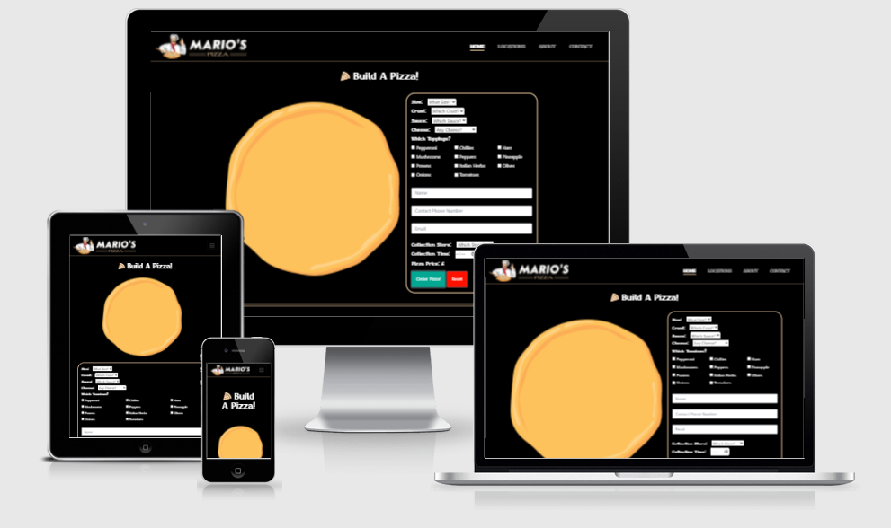

A site designed to provide customers an interactive way to pre-order their pizza from their favourite Mario's Store

----
# User Experience (UX)

* ## Design

     * ### Structure & Mockup Designs

          I started my designs by looking at other similar sites for some inspiration.
          I felt that a key element of each site offering a similar service was that most of the sites were one page designs. Also, the key information that the customers needed were presented to them upon landing at the site. So when I designed the site, I wanted to make sure that the custom pizza order was a main feature of the first image of the site.

          As I wasn't sure how well the pizza images and list would fit on a mobile design, I chose to design the site at full size to begin with. This meant I was able to try a number of different styles of laying out the form without having to worry about space.
          Once I had established the key information I was going to use, I was then able to use the main design and simply drag and drop the form elements into a design I felt worked well on mobile.

          Once I had designed my main feature, I went about seeing what type of navigation would best suit the site. I decided to include a brand navigation bar where the business logo could be placed on the left top corner and as I had very little navigation links, it was easy to style the navigation bar without worrying about content being missed.
          All the links on the navigation bar take the customer to a section within the site and doesn't have the need to include any dropdowns, I think this was important so that the main content of the site was not hidden at any point.

          Following on down the one page design, I felt it was important for the next section to include any additional key information that the customers need to know about the business. I chose to include a section for the customers to find out where all of the business's are located and any specific information for each store e.g. Opening Hours etc.
          I chose to integrate a custom Google Map with markers to point out where each of the stores are located. The initial view of the map is in a zoomed out state so that all markers are visible to the customer, from there on they are able to click which store they would like to know more about, which opens an information box with the store address, opening hours and telephone number. I felt that displaying the information this way would keep the customer interacted with the site and also prevents overloading the customer with a lot of text to read through.

          As the business for the site is a business that has been built through generations of a family and has been operational for quite some time, I wanted to include a short section about the history of the business. I tried to create a simple design that had the feel of an article/biography to share this information. 
          The section contains an old photograph of the curator of the business, although biographies tend to have a large amount of text, again I felt that it was important to keep the family history quite short but detailed the key information of the history. This is because I felt that the target audience that would use such site is an audience that is likely to want to use the site for a short amount of time. They may be likely to want to land at the site, place the order and then leave. 

          <b>Browser Wireframe Design</b>

          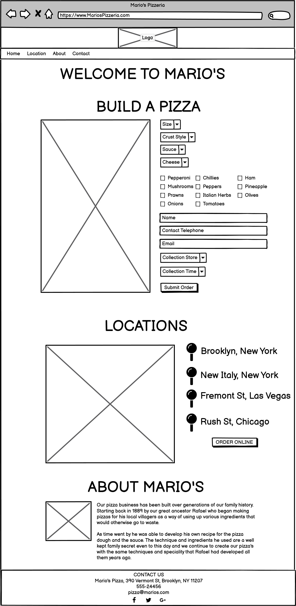

          <b>Mobile Wireframe Design</b>

          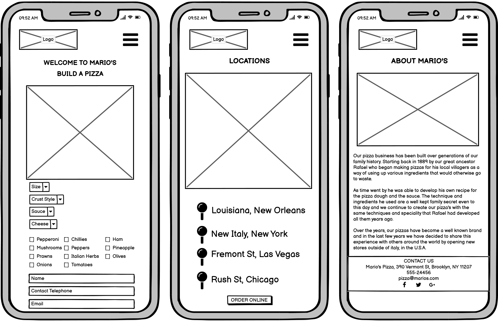

     * ### Colour scheme   
    
          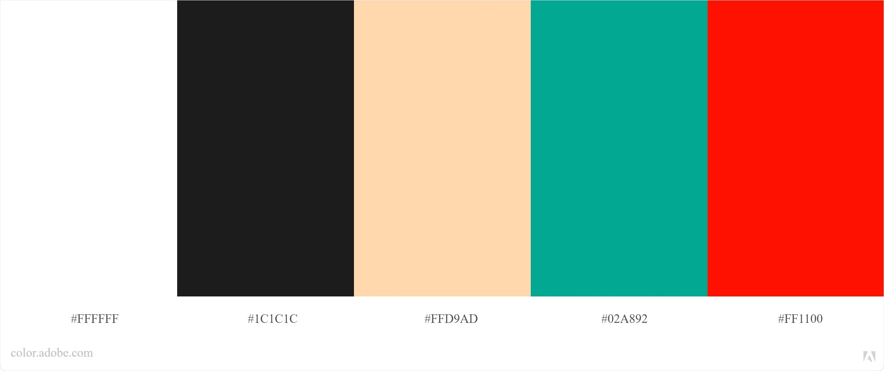

          To choose a compatible color scheme, I decided to use Adobe Color to find colors that would work well together.
          I began by using a couple of the colors that I used to design the logo. I entered the color codes into the site and it came up with other colors that would work well in combination with the colors I had already entered.
          I tend to use this feature by Adobe quite often, as I feel it helps me build a brand from some of my initial ideas.

     * ### Typography 

          When choosing which font to use as part of my design, I felt it was important for it to be easy to read but have an italian feel. 
          I wanted the font to be appropriate so that I could use it for the logo text and also the main site text. This would then help maintain a nice continuity within the design and also help create the italian brand I was aiming for.

          The main font is Otomanopee One[Link](https://fonts.google.com/specimen/Otomanopee+One)
    
          The secondary font is Roboto [Link](https://fonts.google.com/specimen/Roboto?query=roboto#standard-styles)

     * ### What I changed from my mockup designs

          Given that the mockup designs had a small amount of detail, the construction process was where I experimented more with some of the design in terms of colors and fonts and layouts.

          The original page design was created to have a quick load time, and have all the information accessible available to the customers quickly. By choosing a one page design, it was able to achieve all these features and I wanted to make sure I stuck to this original idea.

          There were very little adaptions from the original mockup designs to the final design.

          I changed the logo and navigation bar because the use of the logo at the top center was taking up a large amount of space. When first landing on the page, the build a pizza function was only half visible and didn't have as much impact as the final design does.

          I chose to remove the pins to the right of the map because I felt that the map was already self explanatory and all the pins were visible on the map. By having them displayed to the side of the map also could confuse the visitor and duplicate the information.
----
* ## Images
    * #### Logo
        I designed the logo for the site myself. I had an idea of the type of logo I was looking for when I first thought of the idea and so I thought it would be easier to create the logo myself to achieve the feel I was looking for.
        The chef image was taken from a vector file from Vecteezy, then I added the remaining elements myself.
        By creating the logo myself, I was also able to generate a custom favicon for the site.
        I used Adobe Illustrator to create the logo.

    * #### 'Build A Pizza' Images
        As I needed the ingredients for the pizza to be individual layers that would be visible, even when all the toppings are selected. The best way I could achieve this was to use a vector image of a pizza. (Sourced from Vecteezy)
        I was then able to extract each topping element into individual layers and export as individual image files.
        The ingredients were layed out with least amount of overlapping and exported with a transparent background.
        I generated these images using Adobe Illustrator.

----

* ## Features

     * ### Noteable Features

          * <b>Fixed Navigation Bar</b> - In order to navigate quickly and easily around the site, a fixed navigation bar is always visible at all stages of scrolling across the site.

          * <b>Interactive Custom Pizza Ordering System</b> - Customers are able to easily order a pizza with the ingredients, size and crust of their choice. These changes are instantly displayed on an image to the side of the form and can be ordered at a time of their choice and to a store of their choice.

          * <b>Interactive Map Of Store Locations</b> - All the pizza stores for Mario's business are all displayed on an interactive map that customers can navigate. When a custom marker is clicked, an information box is displayed with all the key information for that store.

          * <b>History of the business</b> - Customers can read about how the business was founded and how it has become the business it is today. 

          * <b>Contact Information</b> - In the footer of the site, all the contact information is avaiable including all of the business's social profiles. A navigation link within the navigation bar will also scroll the user quickly to the bottom of the page to display this information.

     * ### Future Features

          As this project is an ongoing project and I intend to develop it further, here are a few features I feel that could be added to improve the user's experience:
               
          * <b>Payment Gateway</b>
          I would like to introduce a payment gateway to the site so that customers could pay for the pizza in advance. This would be a great advantage for both the store and the customers, it would enable a quicker collection time and also prevent staff having to handle money (especially during Coronovirus restrictions).

          * <b>Order Tracking</b>
          I feel that adding an order tracking feature could make the site more interactive for customers when using the site.
          After placing an order, a customer could be given an order number that could be inputted on an order tracking section of the site. The customer could then see at what stage of the process their order is at and an additional option would be the possibility to edit their order assuming the store hasn't started processing their order.

          * <b>Loyalty Scheme</b>
          This is a feature that could generate repeat visits from customers. Customers could create an account and each time an order is placed, points could then be applied to their points balance and when reaching a certain balance, they could redeem them for money off vouchers or food items. This could attract customers to come back to the store knowing that they may have money off vouchers against their next order.

          * <b>Store Finder</b>
          It would be good to add a 'find a store' feature. Interacting with the google maps API, it could display the nearest store based on the user's location or a location that they enter. This would make finding the nearest store simpler and quicker.

---

* ## Key Components

     * ### Frameworks, Programmes and Libraries:

     *   HTML5
     *   CSS
     *   Javascript
     *   JQuery - Used to simplify and shorten some Javascript commands.
     *   Bootstrap - Used for layouts, styling and custom components such as navigation bar or modals.
     *   Fontawesome - Used for generating the pizza icon's for the titles.
     *   Google fonts - Used to pull the required fonts into the website.
     *   Markdown - Used to write up the README file.
     *   Git - User for Version Control
     *   [GitHub](https://github.com/) - To host the website repositry.
     *   [Tiny PNG](https://tinypng.com/) - Used to help reduce the filesize of the high quality images
     *   Adobe Photoshop & Illustrator
     *   [Am I Responsive](http://ami.responsivedesign.is)

     * ### Integrated API's
          * <b>Google Maps</b>

               I decided the chose to integrate the Google Maps API to allow users to see where Mario's Pizza stores are located.
               Store addresses have been entered as markers, and when clicked an information bar opens to show a photo of the store, opening times and a contact telephone number.

          * <b>EmailJS</b>

               This integrations allows the site to send the pizza order by email to the store using Javascript.
               The integration collects the specified elements from the pizza order form, arranges them into a custom template and sends the order through to the store's email address. The customer also receives a copy of the email to present at the collection store.

               This integration also allows several other features that could be useful for future features. However, these features are restricted to a premium restriction of the service. I had hoped to be able to customise the email form to include the logo and carry the brand of the business. However this is a feature that can only be used with the premium version.

               Here is an example of the email generated by the integration:

               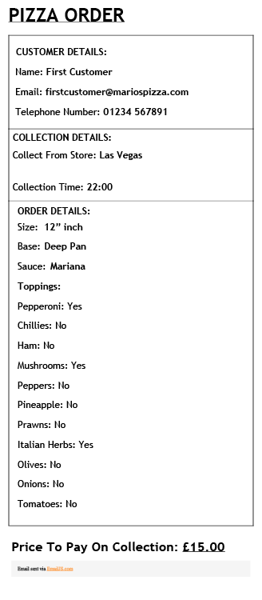 

----

* ## <b>Deployment</b>

     *   ### <b>GitHub Pages</b>

          The site is hosted on GitHub pages. Deploying the site was very easy to do, especially as the repositry was already installed and managed on GitHub.

          I deployed my site during a mentor session and had my mentor guide me through the process. 
          To deploy the site I carried out the following steps:
               - <b>Go To</b> your [GitHub](www.github.com) repository,
               -    In the top right corner <b>Click Settings</b>
               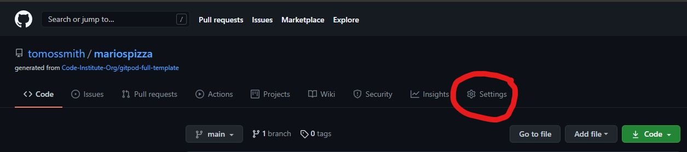 
               - <b>Scroll Down</b> to GitHub Pages
               - <b>Select</b> Main/Master branch from the dropdown menu.
               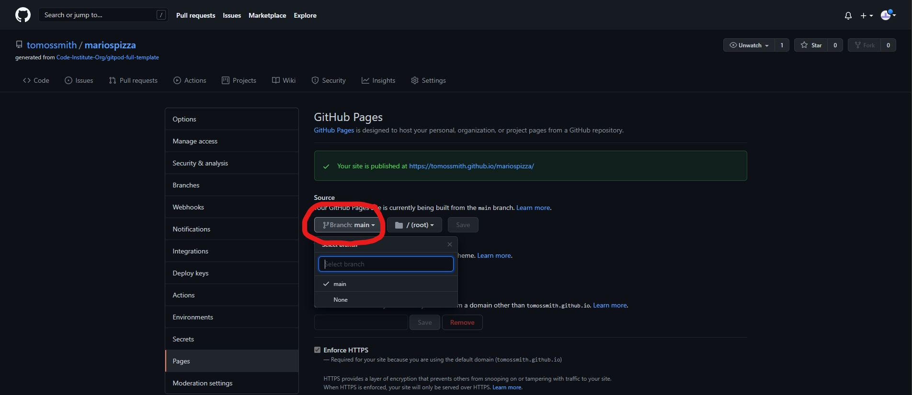 
               - <b>Click Save</b>

          A link will be generated for your live site.
          Initially all the content had not loaded correctly onto the site. After a force reload on my browser, the site displayed correctly.

     *    ### <b>Running the code locally, using your API Keys.</b>

          In order to display the website with all its features, you will need to clone the repositry to your GitHub account or locally. You can then enter your own API keys to enable the features on the site.

          Cloning will enable you to copy all of the site's files at that time, into your own working enviroment to apply any changes or test the site.

          <b>How to clone the repositry</b>
          1. On GitHub, navigate to the repositry location, or [Click Here](https://github.com/tomossmith/mariospizza)
          2. On the right hand side of the page you will see a green button labelled 'Code'. Click This

          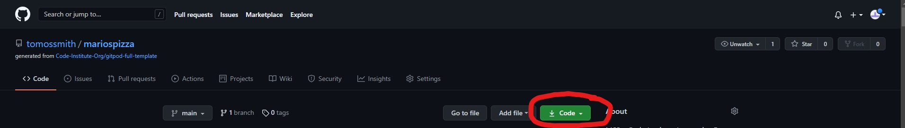 

          3. A menu will appear with different ways of cloning the repositry.

               <b>Clone the Repositry By HTTPS</b>
               a. From the previous step, click on the clipboard button (located after the address) under the 'HTTPS' tab.
               b. Open terminal and change directory to the area you wish to load the repositry into.

               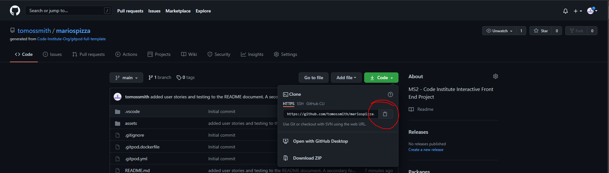 

               c. Once you're in the required directory, enter the command 'git clone' and paste the URL that you added to the clipboard in the previous step.
               - Press Enter

               <b>Clone the Repositry to GitHub Desktop</b>
               a. Follow steps 1,2 and 3 above.
               b. Click 'Open with GitHub Desktop

               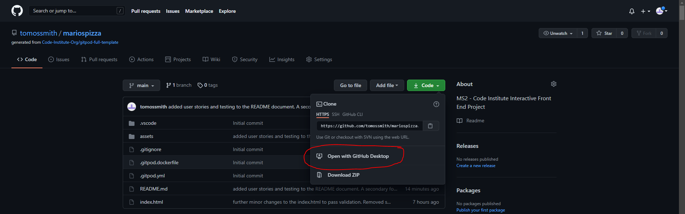 

               c. Follow the prompts within the GitHub Desktop popups to complete the clone.

               <b>How to download a Zip file of the repositry</b>
               a. Follow steps 1,2 and 3 above.
               b. Select the option 'Download Zip'

               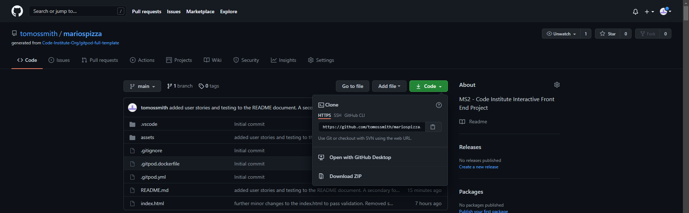 

               Once you have cloned the repositry, you will need to obtain your own Google Maps API key.
               To obtain your own key, you can follow the instructions on the Google Website [Click Here](https://developers.google.com/maps/documentation/maps-static/get-api-key)

               Once you have the key you can enter it on the final line of script within the index.html page.

               The script is formatted as follows: src="https://maps.googleapis.com/maps/api/js?key= ENTER YOUR KEY HERE.
----

* ## Problems 

     <b>Page Background</b>

     When trying to set a page background color, Bootstrap was overiding any parameters I entered.
     I found that applying a more specific parameter would allow the parameters that I set to be applied.

     <b>Javascript Runtime Error</b>

     Kept getting a runtime error on the javascript file, even when the file was empty. 
     I found that if all of Google Chrome's extensions were disabled, then the error would not appear.

     <b>Responsive Pizza Images</b>

     Despite using Bootstrap as part of the site, the pizza images were very difficult to make responsive. The pizza images are all generated as layers for each item, and when I used Bootstrap to try to keep the images responsive, the layers ended up being scattered accross the site.
     To resolve the issue, I had to create individual media queries for several screen widths in order to make sure the images stack correctly.

----

* ## <b>Testing</b>

     *   ###  <b>HTML</b>

          To test my HTML coding, I used the [W3 Validator](https://validator.w3.org/) 

          The validator found a number of errors, of which were repeating errors for the same reasons.
          I had placed '<h4>' tags within the label tags for the main pizza form. I think these were placed in error while building the form and carried through by copy and pasting for each element when building the form.
          To prevent this error, I removed the heading tags and re-committed the document.
          As I had already applied a class to the element, the heading tag was redundant and could be removed without changing the way the elements looked.

          A second error the validator found was for a stray div tag, and an unclosed div tag within a section.
          These seem to have got mis-placed when moving the code around and to resolve the error, I simply moved the closing div tag within the section tags that it belonged to and re-commited the document.

          Once these errors were resolved, the validator returned with no errors.

          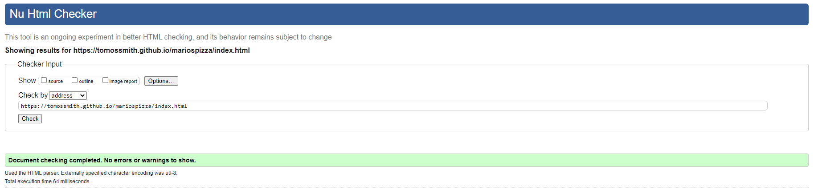

     *   ###  <b>CSS</b>

          To test my CSS coding, I used the [Jigsaw CSS Validation Service](https://jigsaw.w3.org/css-validator) 

          I first entered the URL of my site into the validator, however it returned a large amount of errors that were from the linked Bootstrap CSS documents.

          I therefore chose to use the direct input method in order to display the errors that related only to my css document.

          Upon running this validation it returned 1 error and 1 warning.

          Error: Value Error : float center is not a float value : center

          In order to prevent this error, I removed the 'float' attribute from the document and chose to apply a 'width: 100%' to the image. I needed to have the image placed centrally or at full width in order to prevent the text that was wrapping around the image to be displayed poorly.

          Warning: Same color for background-color and color

          This warning had been flagged because I placed a background-color and color attribute to the .section-line class. As it was a horizontal line I was trying to color, I removed the color attribute and this cleared the warning.

          
          

     *   ###  <b>Javascript</b>

          When running my own Javascript testing I found an error where the order email message being sent didn't include the options selected for the size, crust and sauce of the pizza.
          This was due to the sendEmail function trying to submit the 'value' being returned from the selected option instead of the text. To fix this, I created a variable for each selection to return the text of the user's selected option and then set the email function to call and submit this variable data.

          I also decided to run my function through  [JSHint](https://jshint.com/) in order to try to pickup any errors I may have missed.
          
          I didn't find the website very useful in comparison to the HTML and CSS validator tools, however I was able to pick up a few errors that I had missed.

     *   ###  <b>Overall Website Performance and Compatibility</b>

          In order to make sure that my website was efficient and was able to meet standard website exepectations, I used an open-source developer tool made by Google called  [Lighthouse](https://developers.google.com/web/tools/lighthouse).
          
          To use lighthouse, you need to have an account with Google and also use the Chrome web browser. It asks you to install its plug-in, and once installed you are able to click on the plug-in icon and ask Lighthouse to run its tests on that site.

          I found this tool very useful as it offers lots of useful tips on how your site can be improved.
          My ratings were quite average to begin with, and the least scoring rating was for my website performance.
          I found that due to the several scripts I had placed in the head of my document, it was causing the website to take longer than it should to load. The tool advised me to place these in the end of my body tags in order to load them once the website content had been loaded. By doing so, this increased my score by nearly 20 points and a useful tool to use in the future.

          Although my overall performance rating is still in the amber category, I belive this is because the images that I am loading at startup of the site are causing an additional delay. At the moment, I am not too sure how I could address that issue, but it would be something worth looking into to further develop this site in the future.

          Here were my final scores:

          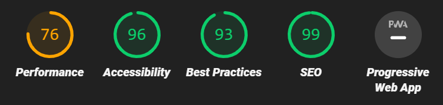

     *   ###  <b>Responsive Design</b>

          I decided to design my site using Bootstrap in order to constrain the content of the site easily and smoothly.
          I was able to ensure that the content on the site scaled or repositioned itself differently depending on the screen dimensions of the device viewing the page.
          However, I did have some difficulty in getting the pizza images to respond well to Bootstrap. Although I set manual column width for different screen dimensions, it would undo the alignment of the layered images of the ingredients. Despite several attempts and different methods, I found that the only way to make sure that the images would be responsive is by creating a selection of standard media query dimensions.

          

     *   ###  <b>Browser compatibility</b>
          
          <b>Google Chrome</b>

          The majority of the tests were carried out using Google Chrome.
          There were no major compatibility issues within Google Chrome apart from a Javascript error being reported in the console. The error was being generated by the plugins that were activated within the Chrome Browser itself. By disabling these plug-ins, it prevented the error from appearing.

          <b>Microsoft Edge</b> - The website functioned correctly with no errors.

          <b>Internet Explorer</b> - The website functions correctly apart from the Google Maps API. After researching online what causes this I found the following information: 

          <i>"Beginning in August 2021, a warning message will appear to Internet Explorer 11 users at the top of maps. The last version of the Maps JavaScript API to support Internet Explorer 11 is v3.47. Support for Internet Explorer 11 will be entirely discontinued in August 2022. This also applies to the IE mode in Edge."</i>

          I believe this would apply to the version of Google Maps API and Internet Explorer that I was using.

          <b>Safari Brower (Using an iPhone)</b> - The website functions and displays as expected.

     *   ###  Link Testing

          All of the links for the site were tested by simply navigating the site in all combinations.

          Any external links were coded to open in a new window with a no referrer tag to prevent passing the referrer information to the target website.

          All of the links behaved as they expected.

     *   ### Testing from User Stories and Experience

          * #### First Time Visitor Goals
    
               * First Time Visitors, should be able to understand the purpose and reason for the site.

                    <i>When visitors land at the site, they are presented with a large logo for the business and shown the custom form to order their pizza.</i>

               * First Time Visitors, should be able to easily find the navigation links.    

                    <i>To follow the natural behavior of most websites, the navigation bar is located at the top of the site and is in a fixed position regardless of where the user scrolls to. This makes sure the user is able to interact with the navigation bar regardless of where they are on the page.
                    For mobile users, the menu bar collapses and displays a 'hamburger symbol' and when clicked, an expanded version of the menu is displayed. This helps make sure the content is always visible to the user as well as making a full size menu available on all screen sizes.</i>

               * First Time Visitors, should be able to interact with the site upon landing on the site.

                    <i>The home section of the site contains the main function of the site. Users are instantly able to interact with a the custom pizza form that displays an image of their custom made pizza as they interact with the form.</i>

                    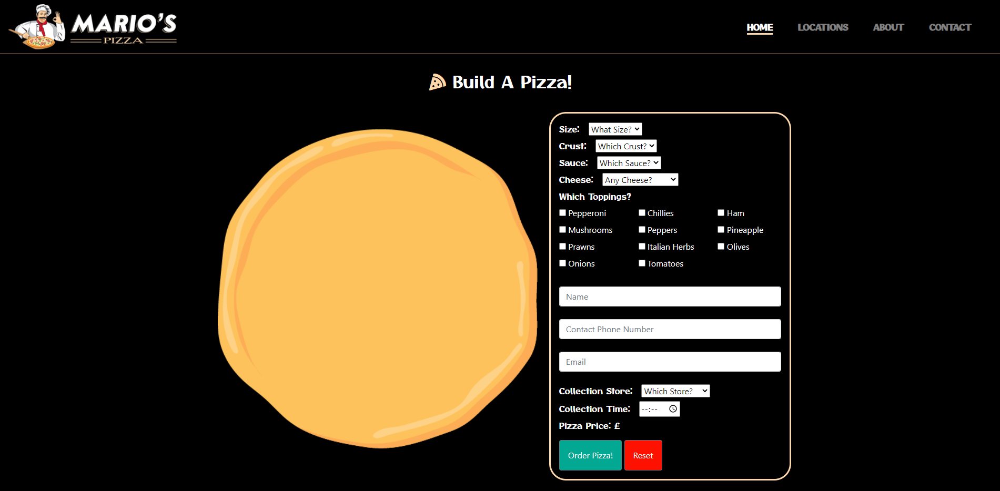
        

          * #### Returning Visitor Goals

               * Returning Visitors, should be able to quickly access the 'build a pizza' element to pre order their pizza.

                    <i>When the customers land on the site, the first section of the site they see is the build a pizza form. Customers can begin filling in the form without needing to scroll down the page to begin.</i>

               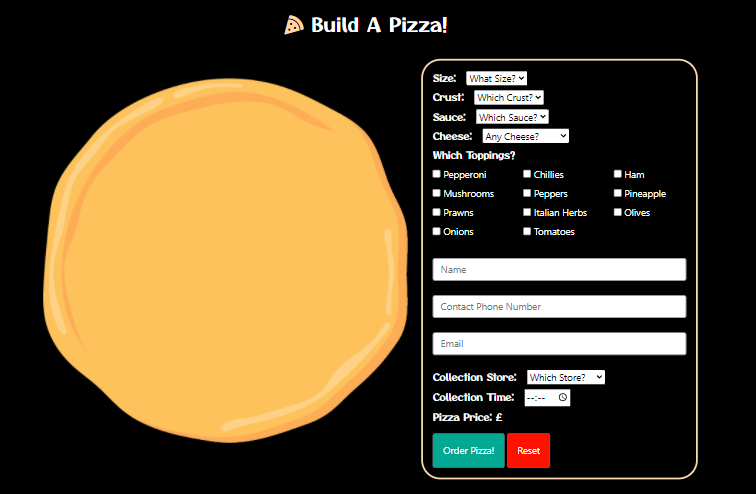

               * Returning Visitors, should be able to find where all the stores are located.

                    <i>In the Store Locations section, there is a map with multiple markers showing where all the stores are located. When the user clicks one of the markers, an information block opens with all the key store information. There is also custom markers to help brand the map with the store logo.</i>

                    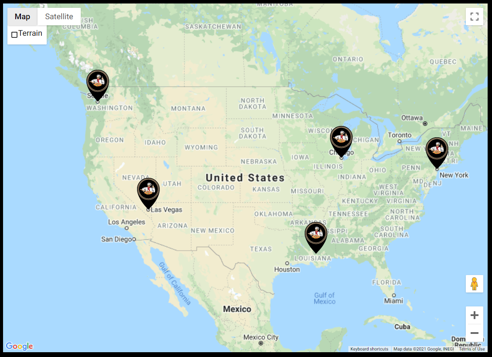

               * Returning Visitors, should have an easy way to contact the stores and in some cases, a specific store. Visitors should also be able to find social links to engage within the online community.

                    <i> Customers are able to contact the head office using the main contact information at the bottom of the page. The footer contains the head office address, telephone number and also all the social profiles for the business.

                    Information for specific stores is detailed when the store markers are clicked at the store location section.</i>

                    

               * Returning Visitors, should be able to find the opening hours and contact information of any store.

                    <i>Key information for each store is displayed when the visitor clicks on the marker for the chosen store.</i>

                    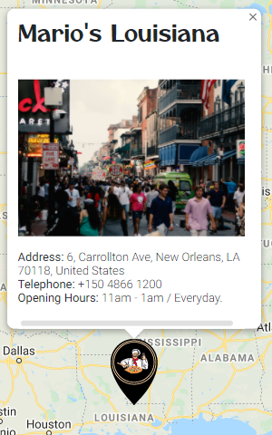

               * Returning Visitors, should be able to find out more information about the history of the store/brand.

                    <i>The history of the family business is found in its own section on the site. This section can be accessed using the navigation link or by scrolling down the site.</i>

                    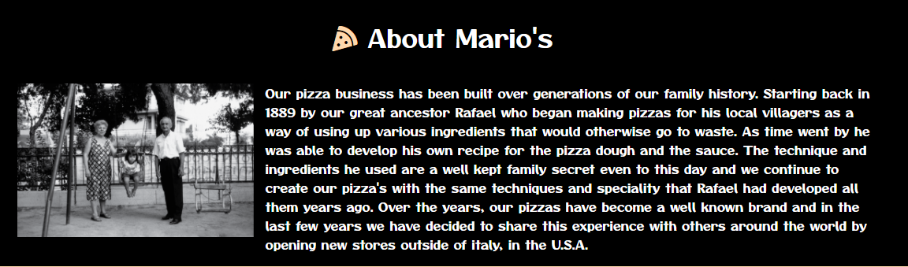

* ## Credits

     *   ###  Code

          [Changing An Image On Dropdown Select Option](https://tutorialdeep.com/knowhow/change-image-on-dropdown-select-option-jquery/)
          I was able to create functions that responded to the checkbox input, but I couldn't work out how to achieve the same on dropdown selections.
          This tutorial was very useful to achieving the function I needed.

          [Google Maps Info Window](https://www.aspsnippets.com/Articles/Google-Maps-API-V3-Add-multiple-markers-with-InfoWindow-to-Google-Map.aspx)
          I needed to create multiple markers on the Google Maps for the store locations. I had tried several methods myself but was unable to achieve the look I was hoping for.
          Upon searching the internet I found this useful article which helped me add the multiple markers and information boxes.

     *   ###  Images/Video

          The images I used for the site were sourced from the following sites and photographers.
          
          *   <b>Pexels</b>

               [New Orleans Image](https://www.pexels.com/photo/people-walking-on-paved-road-2432110/) Photo by Kendall Hoopes

               [Seattle Image](https://www.pexels.com/photo/photo-of-white-ferris-wheel-across-city-buildings-2322707/) Photo by Garrett Morrow

               [Las Vegas Image](https://www.pexels.com/photo/buildings-near-body-of-water-2837909/) Photo by David Vives

               [New York Image](https://www.pexels.com/photo/vehicles-on-road-between-buildings-1389339/) Photo by Helena Lopes

               [Chicago Image](https://www.pexels.com/photo/red-bus-2224424/) Photo by Martin Alargent

          *   <b>Vecteezy</b>

               [Logo Image](https://www.vecteezy.com/free-vector/pizza) by Hakan Kaçar

               [404 Error Image](https://www.vecteezy.com/free-vector/modern) by Nouri Atchabao

          *   <b>Freepik</b>

               [Pizza Images](https://www.freepik.com/free-vector/set-cartoon-pizzas-with-different-stuffing-flat-illustration_14625624.htm) designed using resources from Freepik.com

          *   <b>StockVault</b>

               [Old Photo Couple](https://www.stockvault.net/photo/172769/pictures-of-the-20th-century#) Photo By Aka Maraqu

          *   <b>Multi Platform Mockup Image</b>

               The multi-platform mockup image found within this README file was generated using [Am I Responsive](http://ami.responsivedesign.is/#)

---